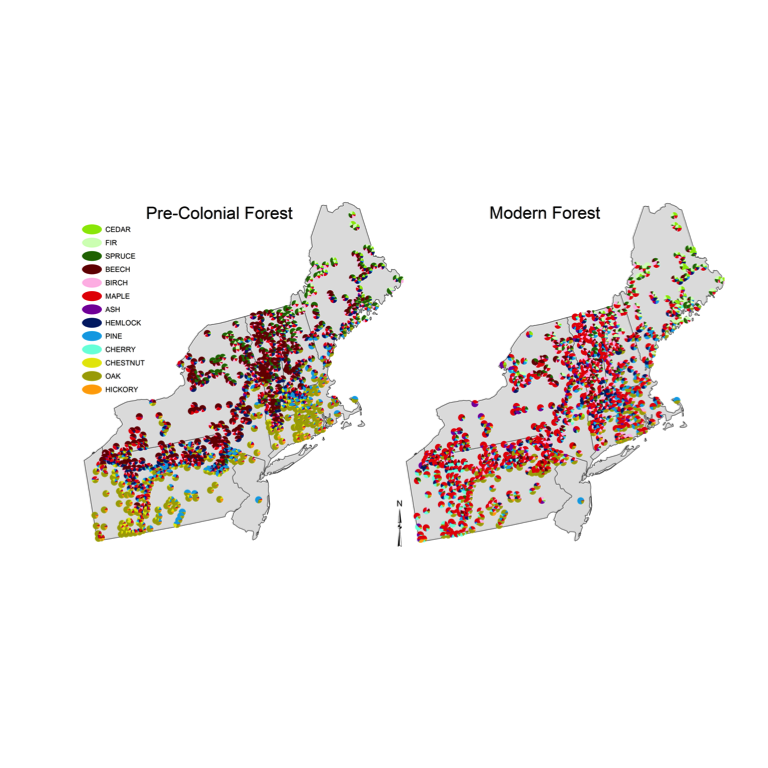

Beginning with LANDIS-II to study Vermont forests
================
Elias M. Guerra
Fall 2017

*This is a edited version of my senior independent biology project using the landscape simulation model LANDIS-II*

#### Introduction

Climate and land use change are having tremendous impact on the natural environment and in turn on humans. In the Northeast, prior to European settlement, the forests were largely untouched. Beginning around 1650, two centuries of logging and agricultural clearing removed or cut almost all forest. In the mid-nineteenth century, agricultural expansion into the midwest and eastern industrialization led to population concentration in urban areas and widespread farm abandonment. This caused two centuries of natural reforestation which has continued until recently. A comparison of pre-colonial and modern forests based on archival, colonial land-survey notes and modern data from the Forest Inventory Analysis database found that while most major tree species remain 1) the relationship between forests composition and the environment has weakened and 2) pre-colonial forests were compositionally more homogenous at short distances and more heterogenous at longer distances.

First, among environmental variables, temperature had the strongest association with forest composition. In the modern forests temperature is still the most important environmental variable but the relationship is much weaker. After temperature, elevation and sand were historically and are still the most important environmental variables. Secondly, pre-colonial forests in the south were dominated by oak and hickory and dissimilar to the spruce-fir forests farther north. In the modern forests, maple is a significant component regardless of location. In general, the modern forest does not represent the original mosaic of forest-types influenced with strong climate-driven compositional gradients. Agricultural land cover continues to decline but the land transition to development now overrides reforestation (Figure 1, Thompson et al. 2013).

##### Figure 1. Pre-colonial and modern forest of the Northeast U.S. *Thompson et al. (2013)*

First, among environmental variables, temperature had the strongest association with forest composition. In the modern forests temperature is still the most important environmental variable but the relationship is much weaker. After temperature, elevation and sand were historically and are still the most important environmental variables. Secondly, pre-colonial forests in the south were dominated by oak and hickory and dissimilar to the spruce-fir forests farther north. In the modern forests, maple is a significant component regardless of location. In general, the modern forest does not represent the original mosaic of forest-types influenced with strong climate-driven compositional gradients. Agricultural land cover continues to decline but the land transition to development now overrides reforestation (Thompson et al. 2013).

Global circulation models agree that the Northeastern US climate will become warmer. Patterns of precipitation are less clear. Possible effects may be increased growth due to a longer growing season, decreased growth in summer months due to greater respiration and evapotranspiration, and shits in tree species ranges. Different species are expected to react differently depending on the life history traits (eg. shade tolerance, thermal tolerance. Duveneck et al. 2016). Harvesting wil be an additional pressure because of growing demand for renewable energy resources like forest-derived biomass for biofuels (Benjamin et al 2009).

In order to understand how climate change and land development will impact the Northeast in future, simulation models are very useful. Computer models of forest change first developed in the late 1960s and early 1970s as researchers in landscape ecology were confronted with the limitations of empirical studies. Experiments over large spatial and temporal scales are often not feasible, hence simulation models. Since the first models such as JABOWA and FOREST appeared, increasing complexity in ecological sciences and landscape models has necessitated advanced models that are not simple caricatures of well-functioning landscapes. Spatially-dynamic models, such as LANDIS-II, are very useful for studying large landscapes while robustly simulating disturbance and succession (Mladenoff et al. 2004, Scheller et al. 2007).

Thompson et al. (2011) used LANDIS-II to model Massachusetts forests by applying scenarios with different climate and harvesting regimes to a simulation over 50 years (2010—2060). They arrived at a few conclusions: First, the largest change in aboveground biomass (AGB) was simply the result of continued stand growth and succession. Even with a continuation of the trends of greater land use and effects of climate change, the simulation predicted a 65% increase in AGB over 50 years (Figure 2). Whether all forests types will continue to be able to accumulate biomass is uncertain.

##### Figure 2. Change in aboveground biomass over a fifty-year simulation with LANDIS-II. *Thompson et al. (2011)*

Scenarios A-H are various combinations of the treatments climate change (CC), standard climate (SC), forest conversion (FC), and harvesting (Harv). The inset histogram shows change from year 0 to year 50 for each scenario.

Second, after growth and succession, forest conversion to developed land had the largest (negative) impact on AGB. Forest conversion was more than four times as destructive as timber harvesting even though harvesting occurred over twice as much area. Third, anthropogenic climate change will have a net positive impact on AGB because of increased temperatures and precipitation. Over 50 years, climate change resulted in a 5.5% greater accumulation of AGB. Fourth, the community composition is shifting to dominance by late-successional species (ie. Tsuga canadensis, Fagus grandifolia). Thompson et al. (2011) did not take CO2 fertilization into account. The model also lacked various types of disturbances such as hurricanes, insect pests, disease, etc. Therefore the model is not totally realistic but instead gives some ideas about the importance of different factors like succession, climate change, and harvesting. The authors suggest that their model is not supposed to represent a prediction of the future, but rather a continuation of the current trends of development, timber harvesting, and growth and succession.

Duveneck et al (2016) used LANDIS-II with the PnET extension to simulate the effects of climate change on New England over 100 years. Using several global climate models (GCM), the simulation indicates that climate change will increase biomass of the forests, particularly along the Atlantic coast, in comparison to climate scenarios based on current conditions. Current climate created a 34% increase in AGB by 2110, while the various climate change scenarios on average created at 82% increase in AGB. Specifically, climate change caused increased AGB in already dominant forest types (northern hardwood, spruce-fir, and pine). As proportions of total AGB, northern hardwood decreased while spruce fir and pine increased. Unlike Thompson et al. (2011), which used biomass succession, Duveneck et al. (2016) were able to include climate extremes in the model by making use of the PnET succession extension. Besides direct climate effects, other biological and anthropogenic disturbances were not included in their model.

#### LANDIS-II

The two studies discussed mades use of LANDIS-II, a physiologically-based, spatially explicit mechanistic model. LANDIS-II is mechanistically simplistic, compared to more complex, fine-scale models like SORTIE which simulates individual trees. This is necessary to simulate large landscape (10-100,000 hectares). Since the original model, LANDIS-II has become more realistic with development of extensions like biomass and PnET, but it still does not model individuals. Succession is based on interactions between species life history attributes (Table 1), site conditions, and disturbance.

| Parameter                              | Units   |
|:---------------------------------------|:--------|
| Longevity                              | years   |
| Sexual maturity                        | years   |
| Shade tolerance                        | meters  |
| Seed dispersal (effective and maximum) | meters  |
| Resprouting age (minumum and maximum)  | years   |
| Resprouting probability                | 0-1     |
| Post-fire regeneration                 | boolean |

##### Table 1. Species life history attributes and units for LANDIS-II.

The landscape is represented by a grid of interacting cells at a user- defined spatial resolution, where each cell represents a different community.

Not done uploading this document...

  <>

  
